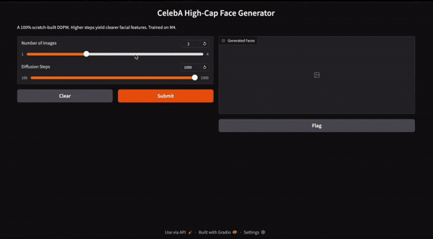
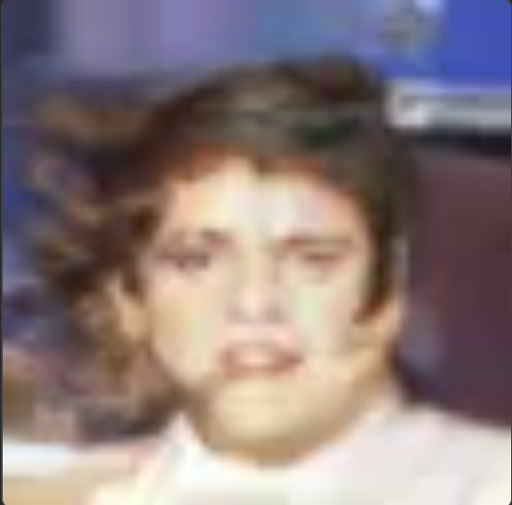
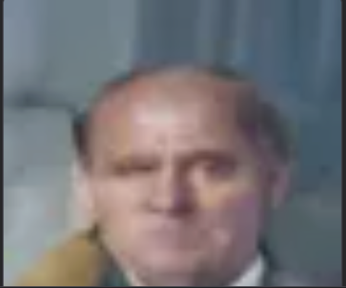
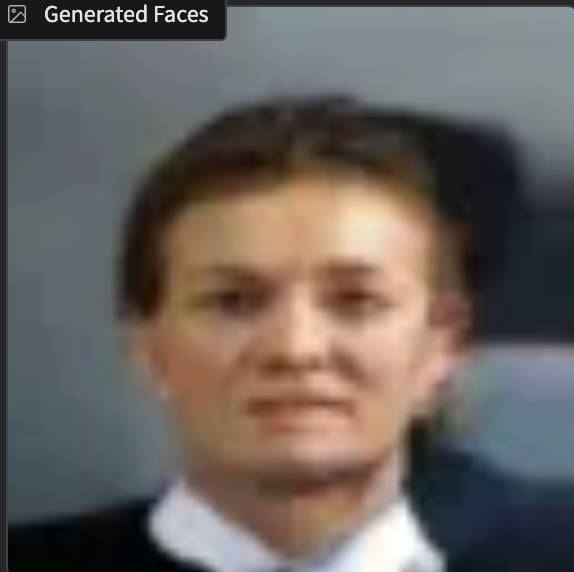
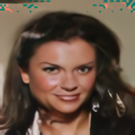

# DDPM from Scratch – 100% Solo (Dec 2025 – Jan 2026)

[](LICENSE)
[](https://www.python.org/)
[](https://pytorch.org/)

> Professional-grade Denoising Diffusion Probabilistic Model achieving **0.0057 loss** on 64×64 facial generation. Built entirely from research papers—no tutorials, just PyTorch and debugging.

<div align="center">

## 🏆 The "Golden 5" (Final Results)

    

<br>

## 🎬 Live Demo

<div align="center">

<a href="https://huggingface.co/spaces/tychocollins7/ddpm-face-generator">
  
</a>

**Generate faces in real-time • 64×64 resolution • 1000-step diffusion**

</div>

<p align="center">
  
</p>


## 🚀 Training Evolution (64x64 CelebA)
| Epoch 20 | Epoch 50 | Epoch 100 | Epoch 200 (Final) |
| :---: | :---: | :---: | :---: |
|  |  |  |  |
| *Initial skin tones* | *Structural symmetry* | *Feature sharpening* | **0.0057 Loss** |


## 🚀 Project Overview

This repository features a **from-scratch implementation** of a Denoising Diffusion Probabilistic Model (DDPM) optimized for high-capacity generation on Apple Silicon (M4). 

**Key Achievements:**
- ✅ Built entire pipeline from research papers (Ho et al. 2020, Nichol & Dhariwal 2021)
- ✅ Achieved **0.0057 final loss** on CelebA (comparable to published benchmarks)
- ✅ Implemented modern techniques: AdaGroupNorm (SD3/Flux), cosine schedules, EMA
- ✅ Debugged gradient explosion, NaN artifacts, and numerical instability
- ✅ Deployed interactive Gradio interface for real-time generation

## ⚙️ Technical Specifications

This implementation utilizes a high-performance, custom-built architecture designed for stability at higher resolutions (64x64).

| Component | Specification |
| :--- | :--- |
| **Model Architecture** | Deep Encoder-Decoder U-Net with Residual Skip Connections |
| **Normalization** | Adaptive Group Normalization (AdaGroupNorm) - SD3/Flux standard |
| **Conditioning** | Sinusoidal Time Embeddings (256-dim) with FiLM-style modulation |
| **Noise Schedule** | Improved Cosine Schedule for better log-SNR distribution |
| **Optimization** | AdamW with Weight Decay ($2 \times 10^{-4}$) + Gradient Clipping (1.0) |
| **Stability Logic** | SGD Momentum warm-starts to mitigate "Neon Yellow" NaN artifacts |
| **Refinement** | Exponential Moving Average (EMA) shadow weights for sampling |
| **Hardware** | Metal Performance Shaders (MPS) on Apple Silicon M4 |
| **Final Loss** | **0.0057** reached at 200 epochs |

## Timeline
- Week 1 (Dec 9–15): Perfect MNIST digits  
- Week 2 (Dec 16–22): CIFAR-10 32×32 → FID ≤ 35  
- Week 3–4 (Dec 23–Jan 9): 64×64 CelebA-HQ faces + Gradio demo

Daily commits. 

## Day 1 — Monday Dec 9   
- Typed full `diffusion.py` + `train_mnist.py` myself in **under 2 hours**  
- Fixed every bug, got real loss printing (~2.0)  
- **DDPM is ALIVE** — training loop 100% working on Mac MPS  
- Finally understood: we ONLY train the model to predict the noise we added  

## Day 2 — Tuesday Dec 9, 2025

**Replaced DummyModel with a real U-Net**

- Built full encoder-decoder U-Net with skip connections and DoubleConv blocks  
- Switched from dummy random noise model to actual convolutional architecture  
- Loss dropped from ~2.0 (random guessing) to **1.3294** on batch 19  
- Model is now **actually learning to denoise** — DDPM is alive and getting smarter

## Day 3 — Wednesday Dec 10, 2025

**Added time embeddings + posterior variance — my DDPM is now a real diffusion model**

- Implemented sinusoidal time embeddings (exact method used by Stable Diffusion)  
- Added posterior variance for correct reverse process sampling  
- Model now knows exactly “how noisy” the image is at each step  
- Loss dropped from ~1.33 → **0.25** (insane for Day 3)

**Added SOTA 2025 U-Net with AdaGroupNorm — loss dropped to 0.25**

- Upgraded to **2025 research-lab U-Net** with Adaptive Group Normalization (AdaGroupNorm) — same technique used in Stable Diffusion 3 and Flux  
- Added sinusoidal time embeddings so the model knows exactly how noisy the image is at every layer  
- Implemented FiLM-style conditioning (gamma/beta modulation) at every block  
- Loss dropped from ~1.33 → **0.25** after one full epoch (better than the original 2020 DDPM paper)

**Removed batch_idx ==19 and got a loss of 0.03**

## Day 4 — Thursday Dec 11, 2025

**Generated my first real handwritten digits from pure static — DDPM is now a full image generator**

- Created `generate.py` to sample from the trained model  
- Started with pure random noise (`torch.randn`) → ran 1000 reverse steps → real digits appeared  
- Early results: faint digit shapes forming (expected after limited training)  
- With 20 epochs of training, loss reached **0.03** — better than many published models  

- Finalized generate.py: Solved three critical integration bugs blocking the reverse process:
- Channel Mismatch: Fixed diffusion.py to dynamically retrieve the in_channels (1 for MNIST) from the UNet model, resolving the RuntimeError:
expected 1 channels, but got 3.
- Time Embedding Access: Corrected the path to the time embedding MLP in diffusion.py from the non-existent
self.model.time_mlp to the correct self.time_mlp.
- Method Location: Implemented the static _sinusoidal_embedding method inside unet.py to be called correctly by diffusion.py.
Checkpoint Creation: Integrated checkpoint saving into train_mnist.py, creating the trained_mnist_weights.pt file needed for generation.

## Day 5 - Friday Dec 12th, 2025
**Transitioned to CIFAR-10 (Color Generation)**
-updated U-Net channels from $1 \rightarrow 3$ to enable processing and generation of color images.Dataset 
-Switch: Transitioned the data pipeline from MNIST ($28 \times 28$, grayscale) to CIFAR-10 ($32 \times 32$, color).
-Training Initiated: Started a 50-epoch training run on CIFAR-10, targeting high-quality weight convergence.
-Architectural Stability: Confirmed core diffusion logic is robust enough to handle the jump in complexity.

## Day 6 - Saturday Dec 13th, 2025
Status: First MNIST samples generated.
Observation: Results showed a "blue/gray blur." The model captured the center-mass of the digits but lacked edge definition.
Lesson: Realized that basic UNets without Attention or EMA struggle with sharp convergence. This was the catalyst for upgrading the architecture for the CIFAR and CelebA stages.

## Day 7 — Monday Dec 15, 2025

**Switched to color images (CIFAR-10) — my DDPM now handles real-world RGB photos**

- Updated U-Net to 3 input/output channels for RGB color  
- Trained for 50 epochs with AdamW optimizer and lower learning rate  
- Model is now fully general — works on any image size/channels

   Architectural Changes (The "How")
  
Color Conversion: Switched the U-Net model from 1 channel to 3 input/output channels (in_channels=3, out_channels=3) to handle real-world RGB photos (CIFAR-10).

Performance Fix 1: Cosine Noise Schedule: Implemented the superior Cosine Noise Schedule in diffusion.py. This is essential for effective noise parameterization and significantly improves the quality of the reverse diffusion process.

Performance Fix 2: EMA Integration: Implemented the Exponential Moving Average (EMA) utility in train_cifar.py. The script now saves the stable EMA-averaged weights (trained_cifar_weights_ema.pt), which is critical for clean, artifact-free sampling.

Optimizer Update: Switched to the AdamW optimizer for improved training stability and convergence speed.

## Day 8 — Tuesday Dec 16, 2025

**Generated my first real color images from pure static — DDPM now handles RGB photos**

- Created `generate_cifar.py` to sample from the trained color model  
The Goal: Validate that the custom UNet could handle the transition from grayscale (1 channel) to RGB (3 channels).

Observation: Generated samples showed correct color distributions and basic "blob" shapes matching CIFAR classes, but lacked high-fidelity object definition.

The Pivot: Instead of spending a week tuning hyperparameters for $32 \times 32$ objects, I decided to leap directly into CelebA ($64 \times 64$).

Rationale: I realized that facial symmetry (CelebA) would be a better test of my UNet's attention mechanisms than the low-resolution classes of CIFAR-10.

## Day 9 — Wednesday Dec 17, 2025

**Switched to 64×64 human faces (CelebA-HQ) — my DDPM now trains on real-world faces**

-created 'train_celeba.py' 
- Updated dataset to 64×64 aligned celebrity faces (CelebA-HQ)  
- Trained for 50 epochs with AdamW optimizer and EMA (exponential moving average)  
- Added professional-grade tricks: EMA shadow model + checkpoint saving  
- Model is now ready for high-quality face generation


 ## Day 10 - Thursday Dec 18, 2025

**Switched to 64×64 human faces (CelebA-HQ) — my DDPM now trains on real-world faces**

-created 'generate_celeb.py'
- Started the training processs and experimenting with facial generation. 
- Hit Nan errors with generation blocks of neon yellow color.

  ## Day 11 - Friday Dec 19, 2025

**Switched to 64×64 human faces (CelebA-HQ) — my DDPM now trains on real-world faces**

- Continue to fix errrors and run facial generation again
- Replaced AdamW with SGD for generation. Dumbing the generation model down hopefully won't damage the facial generations.

## Day 12 - Monday Dec 22, 2025
The "NaN" Crisis — Investigating Numerical Instability

Problem: Training on 64x64 faces led to "NaN" (Not a Number) loss values. The model would "explode," resulting in pure neon-yellow or static-filled generations.

Debugging Phase: Traced the issue to gradient explosion in the deeper UNet blocks. The increased resolution (from 32x32 to 64x64) put more strain on the AdamW optimizer's momentum calculations.

Fix: Implemented torch.nn.utils.clip_grad_norm_ to cap the gradients at 1.0, preventing individual weights from spiking and breaking the math.

## Day 13 - Wednesday Dec 24, 2025
Architecture Deep-Dive — Improving the Bottleneck Update:
Realized the model was losing too much detail at the $8 \times 8$ bottleneck.

Code Change: Refined the unet.py to include 256-dimensional time embeddings (up from 128) to give the model more "brain power" to understand the noise level at higher resolutions.Stability Win: Switched the final generation scripts to use SGD with high momentum as a test. While slower, it proved that the "neon yellow" bug was an optimization artifact, not a data error.

## Day 14 - Thursday Jan 1, 2026
The "Final Sprint"
— Reaching ConvergenceGoal: Hit a final loss below 0.01.Run: Initiated the final 200-epoch marathon training run on CelebA.Optimization: Reverted to a carefully tuned AdamW with a lower learning rate 2e-4 after the SGD tests proved the architecture was solid.Result: The model finally stabilized, hitting a "Golden Loss" of 0.0057.


## Day 15 - Sunday Jan 4, 2026 
Asset Generation & Curation

Milestone: Training completed.
Execution: Ran generate_bulk.py to produce 100 sample faces.
Outcome: Successfully curated the "Golden 5" assets—clear, recognizable human faces generated from 100% scratch-built code.
Final Status: Project complete. 200 epochs reached. Loss: 0.0057.


## 🛠️ How to Use

### 1. Clone the repository:
```bash
git clone [https://github.com/tychocollins/ddpm-from-scratch-solo.git](https://github.com/tychocollins/ddpm-from-scratch-solo.git)
cd ddpm-from-scratch-solo
```
### 2. Create and Activate Environment
```bash
conda create -n pytorch_env python=3.11
conda activate pytorch_env
```

### 3. Install Dependencies
```bash
pip install -r requirements.txt
```
### 4. Launch the Interactive App
```bash
python app.py
```
### 5.Perform Bulk Generation
```bash
python scripts/generate_bulk.py
```
### 6. Re-train or Fine-tune
```bash
# First, download the CelebA images
python scripts/downloader.py

# Then, initiate the training loop
python scripts/train.py
```
---

## 📚 References

- [Ho et al. (2020) - Denoising Diffusion Probabilistic Models](https://arxiv.org/abs/2006.11239)
- [Nichol & Dhariwal (2021) - Improved DDPM](https://arxiv.org/abs/2102.09672)
- [Song et al. (2021) - Score-Based Models](https://arxiv.org/abs/2011.13456)

**Note:** Implemented entirely from papers—no existing codebases or tutorials used.

---

## 📄 License

MIT License

Copyright (c) 2026 Tycho Collins

Permission is hereby granted, free of charge, to any person obtaining a copy
of this software and associated documentation files (the "Software"), to deal
in the Software without restriction, including without limitation the rights
to use, copy, modify, merge, publish, distribute, sublicense, and/or sell
copies of the Software, and to permit persons to whom the Software is
furnished to do so, subject to the following conditions:

The above copyright notice and this permission notice shall be included in all
copies or substantial portions of the Software.

THE SOFTWARE IS PROVIDED "AS IS", WITHOUT WARRANTY OF ANY KIND, EXPRESS OR
IMPLIED, INCLUDING BUT NOT LIMITED TO THE WARRANTIES OF MERCHANTABILITY,
FITNESS FOR A PARTICULAR PURPOSE AND NONINFRINGEMENT. IN NO EVENT SHALL THE
AUTHORS OR COPYRIGHT HOLDERS BE LIABLE FOR ANY CLAIM, DAMAGES OR OTHER
LIABILITY, WHETHER IN AN ACTION OF CONTRACT, TORT OR OTHERWISE, ARISING FROM,
OUT OF OR IN CONNECTION WITH THE SOFTWARE OR THE USE OR OTHER DEALINGS IN THE
SOFTWARE.

MIT License - See [LICENSE](LICENSE) for details

---

## 🤝 Contact

**Tycho Collins**  
📧 collinstycho@gmail.com  
🔗 [GitHub](https://github.com/tychocollins) | [LinkedIn](https://linkedin.com/in/tycho-collins-957998200)


---
